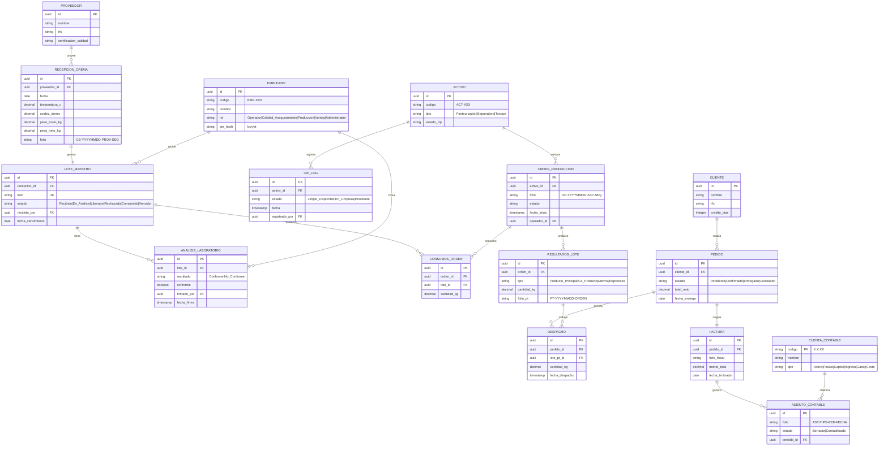

# Entity-Relationship Diagram — Core Data Model

## Main Traceability Flow

The central design pattern is `lote_maestro` as the single source of truth for every
batch of raw cream. All downstream records (lab analysis, production, sales, invoicing)
reference this entity, enabling end-to-end traceability.

---

## Extended Modules (360° Coverage)

Beyond the core traceability flow above, the schema includes six additional modules
that complete the 360° view of the business:

| Module | Key Entities | Purpose |
|--------|-------------|---------|
| **WMS** | `ubicacion`, `stock_actual`, `movimiento_inventario` | Warehouse locations, stock control, kardex |
| **S&OP** | `pronostico_demanda`, `plan_produccion` | Demand forecasting vs. actual production |
| **QMS/HACCP** | `punto_control_critico`, `monitoreo_pcc`, `desviacion_haccp` | HACCP critical control points and deviations |
| **RRHH** | `periodo_nomina`, `recibo_nomina` | Payroll periods and pay stubs with auto accounting |
| **IoT** | `telemetria_peso`, `telemetria_temperatura` | Real-time sensor readings via MQTT |
| **Contabilidad** | `costeo_lote`, `periodo_contable` | Cost absorption by batch, period close |

Total: **49 tables** across all modules, all in the `pasteurizadora` PostgreSQL schema.

---

## Folio System

Every entity that participates in traceability has a structured folio:

| Entity | Pattern | Example |
|--------|---------|---------|
| Raw cream batch | `CB-YYYYMMDD-PROV-SEQ` | `CB-20260601-0012-001` |
| Production order | `OP-YYYYMMDD-ACT-SEQ` | `OP-20260601-003-0042` |
| Finished product | `PT-YYYYMMDD-ORDEN` | `PT-20260601-0042` |
| Accounting entry | `AST-TIPO-REF-FECHA` | `AST-NOM-REC-20260615` |

These folios are generated by PostgreSQL functions at insert time, not by the application,
ensuring uniqueness and consistency regardless of the client.
